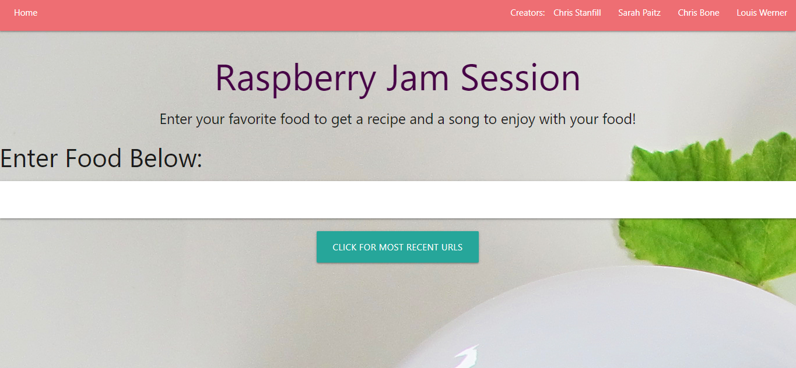

# Raspberry-Jam-Session
Raspberry-Jam-Session is a webpage that gives the user a song to match with whatever food they want to eat. The user enters a type of food into the input field, and the application returns two cards. One card includes information about a recipe, and the other card includes information about a song to go with the recipe. 

There are also creator tabs in the navbar at the top of the page. These pages give a brief description of the creators of this website, and a food and music combination of their choice.

Additionally, there is a last search button that takes the user to a separate page that holds the url for their last search. 

## Mock Up
Here is a picture of the initial page. 

Here are two pictures of the cards the user recieves after they type their food into the input field. The user typed in "chicken", and the application rendered a music card and a recipe card.

### Deployment
https://ccsxw6.github.io/Raspberry-Jam-Session/ 